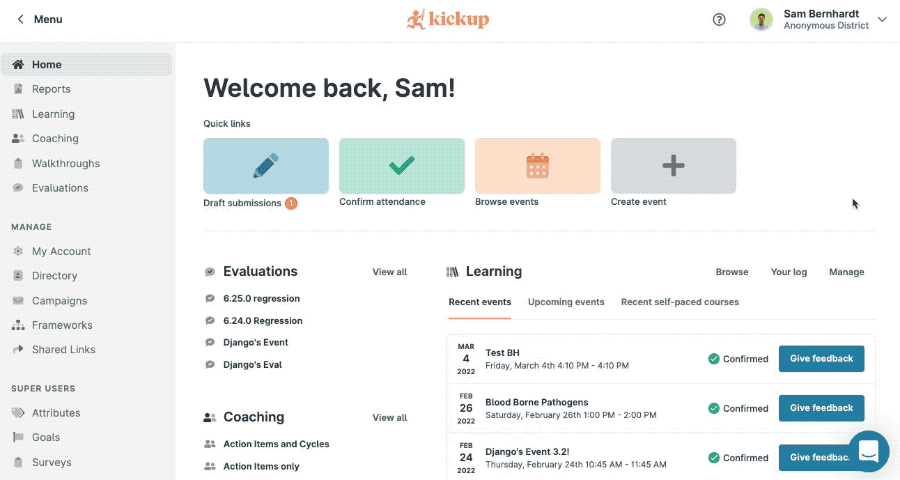

# KickUp command palette ⚡️

### Installation

#### 1. Download/clone this repository  
`git clone https://github.com/sambernhardt/pulse-extension.git`  
or  
Download https://github.com/sambernhardt/pulse-extension/archive/main.zip

#### 3. Turn on "Developer mode" on the Extensions page in Chrome.

#### 4. Click "Load unpacked" and select the downloaded/cloned folder

#### 5. Save some time. 💪🕑

---

## Features
#### Keyboard Shortcuts ⚡️
- `cmd` + `/`: Open command palette
- Up/down arrow keys to change the selected item
- `Enter`: Navigate to the selected item

#### Switch District ⚡️
- Auto-focused search input
- Recent selections
- Save districts by marking them with a star
